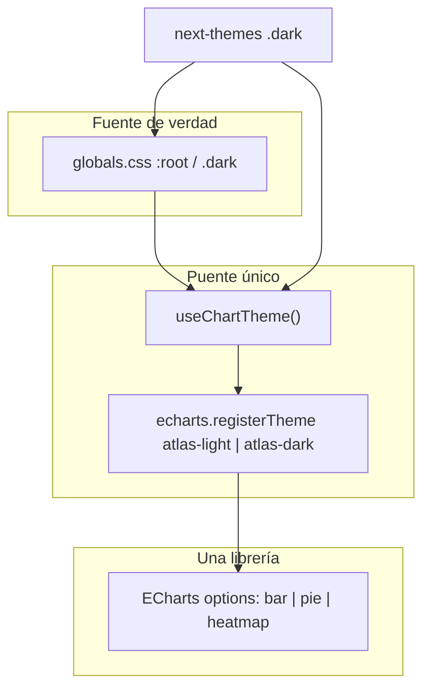

# Plan refinado: Dark theme + una sola librería de gráficas

## Aclaración sobre specs y estado del repo

Los documentos en [`specs/dark-mode-spec.md`](specs/dark-mode-spec.md), [`specs/dark-mode-audit.md`](specs/dark-mode-audit.md) y [`specs/critical-fixes-audit.md`](specs/critical-fixes-audit.md) **no reflejan el código actual**:

- `ThemeToggle.tsx` **no existe** (el audit lo marca como implementado).
- El dark mode se **deshabilitó explícitamente** tras cambios en el light theme (`forcedTheme="light"` en [`layout.tsx`](src/app/layout.tsx)).
- Los tokens `.dark` en [`globals.css`](src/app/globals.css) pueden estar **desalineados** con el light refinado reciente — hay que validar visualmente, no confiar en los hex del audit de enero 2025.
- La migración a tokens semánticos en componentes está **mucho más avanzada** que en los specs (p. ej. ya no hay `bg-white` sueltos en `src/`).

**Principio rector (sin cambiar tu petición):** el light theme actual es la referencia de producto; dark es variante; las gráficas deben seguir la misma semántica de color (`chart-1..8`, success/warning/danger).

---

## Investigación: ¿una sola librería?

### Inventario real en el código (mayo 2026)

| Vista | Librería | Tipos de chart |
|-------|----------|----------------|
| [`overview.tsx`](src/components/dashboard/overview.tsx) | **Recharts** | Barras verticales (secciones, factores), donut (`PieChart`), más barras operativas |
| [`facilities.tsx`](src/components/dashboard/facilities.tsx) | **Recharts** | Benchmark horizontal (2 series) |
| [`comparative.tsx`](src/components/dashboard/comparative.tsx) | **Recharts** + **ECharts** | 7× `ComparisonBar`; 2× heatmap (`buildHeatmapOption` + `ReactECharts`) |

**Dependencias actuales:** `recharts@3.8.1`, `echarts@6.0.0`, `echarts-for-react@3.0.6`.

### Comparativa (fuentes: documentación oficial + ecosistema 2026)

| Criterio | Recharts 3.8 | Apache ECharts 6 | Nivo (@nivo/*) |
|----------|--------------|------------------|----------------|
| **Heatmap** | No en 3.8.1 instalado (PR [#7225](https://github.com/recharts/recharts/issues/7225) en curso, no mergeado en npm aún) | Nativo [`series-heatmap`](https://echarts.apache.org/en/option.html#series-heatmap) + `visualMap` | `@nivo/heatmap` (SVG/Canvas) |
| **Barras / pie** | Excelente, API React composable | Bar, pie, bar layout vertical = `xAxis/yAxis` swap | Bar, pie por paquete |
| **Dark mode** | `var(--color-*)` en SVG — automático con `.dark` | Tema built-in `'dark'` + `registerTheme` + prop `theme` en wrapper | `theme` object manual ([guía](https://nivo.rocks/guides/theming)); sin toggle OOTB ([discusión](https://github.com/plouc/nivo/discussions/2387)) |
| **CSS variables** | Sí, nativo | **No** — requiere colores resueltos (hex/rgb) | No en series; tema + `colors` props |
| **Bundle** | ~50 kB gz (solo Recharts) | ~100 kB gz tree-shaken ([handbook import](https://echarts.apache.org/handbook/en/basics/import/)) | 30–80 kB por chart type; varios paquetes |
| **Next.js 16** | Sin fricción especial | `transpilePackages: ['echarts', 'zrender']` ([echarts-for-react README](node_modules/echarts-for-react/README.md)) | SSR posible; más fricción en App Router según comunidad |
| **Ya en el proyecto** | 3 vistas | Heatmaps comparativos | No instalado |

### Alternativas descartadas para “una sola librería”

1. **Solo Recharts** — Requiere reimplementar heatmaps sin API estable (3.8.1 no exporta `HeatMap`) o esperar release futuro → **alto riesgo** para comparative.
2. **Solo Nivo** — Migración total de ~10 charts + theming manual + nueva dependencia; heatmap sí, pero **no aporta** ventaja sobre ECharts ya presente.
3. **Chart.js / ApexCharts** — Menos tipos avanzados (heatmap peor que ECharts); migración completa sin beneficio claro.

### Recomendación: **Apache ECharts 6** (vía `echarts-for-react/lib/core`)

**Por qué encaja con bioDashboard:**

1. **Ya cubre el chart más difícil** (matrices de riesgo external/internal).
2. **Unifica el problema de dark mode en gráficas:** una sola estrategia de color (no mitad CSS vars + mitad `useChartColors`).
3. **Documentación oficial de theming:**
   - Tema oscuro integrado: `echarts.init(dom, 'dark')` ([Style handbook](https://echarts.apache.org/handbook/en/concepts/style/)).
   - Temas de marca: `echarts.registerTheme('atlas-light', json)` y `theme="atlas-light"` en [`ReactECharts`](node_modules/echarts-for-react/README.md).
   - Paleta global en `option.color` alineada a `--color-chart-1..8`.
   - `visualMap` para escalas semánticas (heatmap compliant/no compliant) — ya usado en `buildHeatmapOption`.
4. **Tree-shaking** reduce bundle vs `import * as echarts from 'echarts'` duplicado + Recharts:
   - Registrar solo: `BarChart`, `PieChart`, `HeatmapChart`, `GridComponent`, `TooltipComponent`, `TitleComponent`, `VisualMapComponent`, `CanvasRenderer`.
5. **Elimina la deuda dual** documentada en [`specs/critical-fixes-audit.md`](specs/critical-fixes-audit.md) (ECharts ilegal con `var()`).

**Trade-off honesto:** las barras/donuts pasan de JSX declarativo (Recharts) a **options objects** — más verboso, pero un solo modelo mental y un solo puente de tema.

---

## Estrategia de theming ECharts (documentación directa)

No usar el tema genérico `'dark'` de ECharts tal cual (paleta por defecto no coincide con Atlas Biosecurity). En su lugar:

### 1. Módulo central [`src/lib/echarts.ts`](src/lib/echarts.ts) (nuevo)

- `echarts/core` + imports tree-shaken ([handbook](https://echarts.apache.org/handbook/en/basics/import/)).
- `echarts.use([...])` una sola vez.
- Exportar instancia `echarts` registrada para `ReactEChartsCore`.

### 2. Puente CSS → ECharts [`src/hooks/useChartTheme.ts`](src/hooks/useChartTheme.ts) (evolución de `useChartColors`)

- Leer con `getComputedStyle(document.documentElement)` los mismos tokens que hoy: `--color-chart-*`, `--color-text-*`, `--color-raised`, `--color-border-*`, `--color-success/warning/danger`.
- Construir objeto `registerTheme` con:
  - `color: [chart1, chart2, ...]` (paleta categórica)
  - `backgroundColor: 'transparent'`
  - `textStyle.color`, `axisLine.lineStyle.color`, `splitLine.lineStyle.color`, etc.
- `echarts.registerTheme('atlas-light', …)` / `registerTheme('atlas-dark', …)` al montar y **en cada cambio** de `resolvedTheme` (MutationObserver en `html.class` + `useTheme` de next-themes).
- Retornar `themeName: 'atlas-light' | 'atlas-dark'` para el prop `theme` del wrapper.

### 3. Componente wrapper [`src/components/charts/echarts-chart.tsx`](src/components/charts/echarts-chart.tsx) (nuevo)

- `ReactEChartsCore` + `echarts` del módulo central.
- `dynamic(..., { ssr: false })` (patrón Next.js ya usado en comparative).
- Props: `option`, `height`, `ariaLabel`; internamente `theme={themeName}`, `notMerge`, `key={themeName}` para repintado fiable al togglear.

### 4. Helpers de option (mantener lógica de negocio)

- Extraer builders tipados: `buildBarOption`, `buildPieOption`, reutilizar/refactorizar `buildHeatmapOption` desde [`comparative.tsx`](src/components/dashboard/comparative.tsx).
- Factores compartidos: márgenes adaptativos (equivalente a `getAdaptiveVerticalBarLayout`), truncado de labels, tooltips con colores del tema resuelto.

### 5. Preservar look del light

- Los **valores** de `option` en light deben reproducir el mismo layout visual que Recharts (bar radius, grid horizontal-only, labels a la derecha en barras verticales).
- QA lado a lado screenshots antes de borrar Recharts.

---

## Plan de implementación por fases

### Fase 0 — Infraestructura de tema app (P0, sin tocar librerías aún)

Igual que antes, pero **sin depender de specs antiguos**:

- [`layout.tsx`](src/app/layout.tsx): quitar `forcedTheme`; `defaultTheme="light"`; `enableSystem` opcional (traducciones `theme.*` ya existen).
- Crear `ThemeToggle` con guard `mounted` ([hydration](specs/critical-fixes-audit.md)).
- Header: toggle desktop; móvil en `DropdownMenu`; logo [`atlasBiosecurity-dark-theme.png`](public/atlasBiosecurity-dark-theme.png).
- Re-validar tokens `.dark` contra light actual (superficies, cards, contraste texto) — ajuste fino mínimo en [`globals.css`](src/app/globals.css) solo si QA falla.

**Éxito:** light pixel-parity con producción actual; dark conmutable sin errores de hidratación.

### Fase 1 — Módulo ECharts + puente de tema (P0)

- Añadir `transpilePackages: ['echarts', 'zrender']` en [`next.config.ts`](next.config.ts) (requerido por [echarts-for-react para Next 13+](node_modules/echarts-for-react/README.md)).
- Implementar `src/lib/echarts.ts`, `useChartTheme`, `EChartsChart` wrapper.
- Migrar **solo heatmaps** de comparative al wrapper (misma UI; eliminar `useChartColors` suelto → absorbido por `useChartTheme`).
- Verificar: sin warnings `illegal color`; toggle light/dark actualiza heatmaps sin reload.

### Fase 2 — Migración Recharts → ECharts (P1)

Orden sugerido (menor → mayor riesgo visual):

1. [`facilities.tsx`](src/components/dashboard/facilities.tsx) — 1 benchmark chart (2 colores + `color-mix` equivalente en `itemStyle`).
2. [`comparative.tsx`](src/components/dashboard/comparative.tsx) — 7 `ComparisonBar` → `buildBarOption` (categorical `color` por chart).
3. [`overview.tsx`](src/components/dashboard/overview.tsx) — barras con `sectionColor` semántico + donut multi-slice.

Refactor compartido:

- [`chart-card.tsx`](src/components/charts/chart-card.tsx): sustituir `SafeResponsiveContainer` + Recharts por contenedor div + `EChartsChart`; mantener `ChartCard`, heights, `CHART_TOOLTIP_*` solo si aplica (tooltips pasan a `option.tooltip`).

**Éxito:** eliminar `recharts` de `package.json`; bundle total ≤ suma actual o menor tras tree-shake.

### Fase 3 — Mapa (P1)

- [`MapLibreFacilitiesMap.tsx`](src/components/dashboard/MapLibreFacilitiesMap.tsx): basemap Carto dark-matter en dark, Liberty en light (`useTheme().resolvedTheme`).
- Popups/controles: ya parcialmente en `.dark` en globals.css.

### Fase 4 — Regresión y contraste (P2)

- Matriz light/dark: overview, facilities, comparative, mapa.
- Criterio del comentario original: barras `chart-*` legibles sobre `--color-raised` en dark.
- Roles: admin, producer, public; persistencia `localStorage` entre locales.

---

## Qué NO hacer

- Rediseñar el light theme (layout, tipografía, cards, métricas).
- Confiar en [`specs/dark-mode-spec.md`](specs/dark-mode-spec.md) como checklist de implementación sin verificar repo.
- Mantener Recharts + ECharts a largo plazo (duplica mental model y dark-mode plumbing).
- Usar tema ECharts `'dark'` stock sin `registerTheme` Atlas (rompe identidad de marca).
- Migrar a Nivo solo por “ser React-native” — coste alto sin eliminar el problema heatmap/ECharts.

---

## Riesgos y mitigaciones

| Riesgo | Mitigación |
|--------|------------|
| Regresión visual en light al migrar barras | Migración incremental + screenshots; `defaultTheme="light"` |
| Bundle ECharts grande | Tree-shake estricto en `src/lib/echarts.ts`; medir `next build` antes/después |
| Options más verbosos | Builders compartidos `src/lib/chart-options/*` |
| Hidratación toggle | `mounted` en ThemeToggle |
| Next.js transpile | `transpilePackages` en config |
| Heatmap semantics | Conservar `visualMap.inRange` con success/warning/danger del puente de tema |

---

## Archivos clave

| Archivo | Rol |
|---------|-----|
| [`src/lib/echarts.ts`](src/lib/echarts.ts) | Registro tree-shaken único |
| [`src/hooks/useChartTheme.ts`](src/hooks/useChartTheme.ts) | CSS tokens → `registerTheme` |
| [`src/components/charts/echarts-chart.tsx`](src/components/charts/echarts-chart.tsx) | Wrapper React + dynamic |
| [`src/lib/chart-options/`](src/lib/chart-options/) | Builders bar / pie / heatmap |
| [`src/app/layout.tsx`](src/app/layout.tsx) | Habilitar next-themes |
| [`src/components/theme/ThemeToggle.tsx`](src/components/theme/ThemeToggle.tsx) | Nuevo |
| [`next.config.ts`](next.config.ts) | `transpilePackages` |
| Vistas dashboard | Migración chart por chart |
| [`package.json`](package.json) | Remover `recharts` al final |

---

## Alcance acordado

**Entrega integrada:** dark mode + migración a ECharts como única librería de gráficas en la misma implementación (evita repetir el trabajo de contraste y theming en dos stacks).
