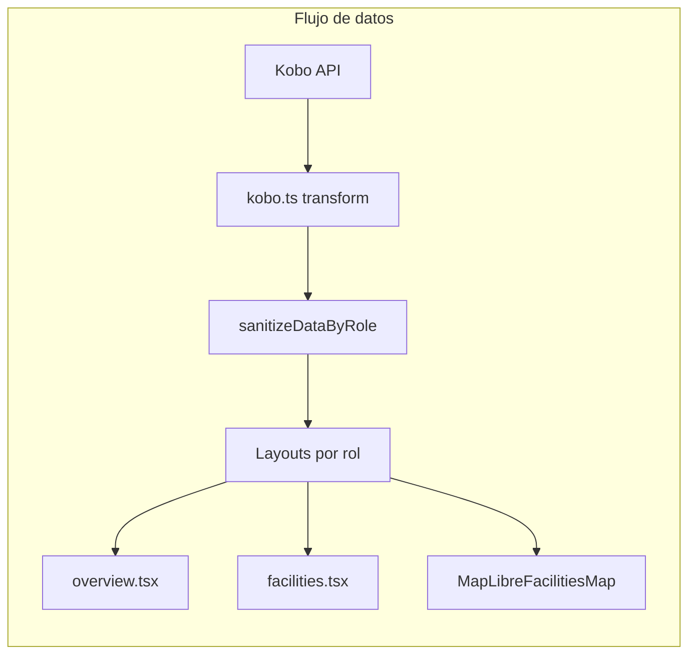
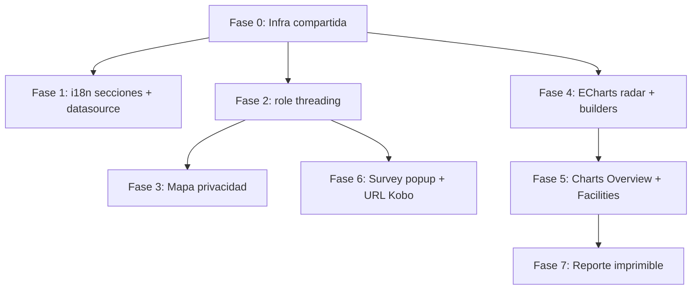

# Plan de implementación — Requerimientos bioDashboard

## Contexto técnico actual

| Área | Tecnología | Estado actual |
|------|------------|---------------|
| Framework | Next.js 16 App Router + React 19 | — |
| Auth/roles | Clerk + [`access-control.ts`](src/lib/access-control.ts) | `public`, `producer`, `admin` |
| Datos | KoboToolbox API → [`kobo.ts`](src/lib/kobo.ts) + [`score-model.json`](src/data/score-model.json) | Scores por sección ya calculados |
| Mapa | MapLibre GL + `react-map-gl` + Supercluster | [`MapLibreFacilitiesMap.tsx`](src/components/dashboard/MapLibreFacilitiesMap.tsx) — sin restricciones por rol |
| Gráficos | ECharts 6 (Bar, Pie, Heatmap) | [`echarts.ts`](src/lib/echarts.ts) — **sin RadarChart** |
| i18n | next-intl — [`en.json`](src/messages/en.json), [`es.json`](src/messages/es.json), [`no.json`](src/messages/no.json) | 11 secciones mapeadas en [`section-labels.ts`](src/lib/section-labels.ts) |
| Reportes | — | **No existe** print/PDF |
| Encuesta | Kobo `deployment__links` en asset API | **No expuesto** al frontend |



---

## 1. Privacidad del mapa (15 km, solo admin con zoom completo)

### Objetivo
Usuarios **público** y **productor**: ver ciudad + conteo de predios, sin ubicación exacta ni popup de predio. **Admin**: zoom completo + popup al clic.

### Enfoque recomendado (defensa en profundidad)

**A. Propagar `role` hasta el mapa**

Cadena: [`dashboard-client.tsx`](src/components/dashboard/dashboard-client.tsx) → layouts → [`overview.tsx`](src/components/dashboard/overview.tsx) → [`MapLibreFacilitiesMap.tsx`](src/components/dashboard/MapLibreFacilitiesMap.tsx).

```tsx
// Nuevo prop en MapLibreFacilitiesMap
role: AppRole;
mapMode: "admin" | "restricted";
```

**B. Modo restringido (public + producer)**

1. **Agregación por ciudad** — agrupar facilities por `basedOn ?? location` (ya usado en `data.operations.byLocation`). Un marker por ciudad con el conteo de predios.
2. **Coordenadas** — usar centroide de las geolocalizaciones del grupo (o primera coordenada del grupo con jitter determinístico de ~1–2 km para no revelar predio individual).
3. **`maxZoom`** — calibrar a ~15 km de ancho visible. Con contenedor ~600 px y latitud media ~4.5°: `maxZoom={12}` (~23 km) o `maxZoom={11}` (~46 km). Ajustar empíricamente en dev hasta ~15 km.
4. **Sin popups de predio** — deshabilitar `setSelectedFacility` y no renderizar `<Popup>` / `FacilityPopup`.
5. **Popup de ciudad** — al clic en marker de ciudad, mostrar solo: nombre de ciudad + `N predios` (sin nombres ni scores individuales).
6. **Supercluster** — en modo restringido, operar sobre puntos de ciudad (no facilities individuales); bajar `maxZoom` del cluster para evitar descomposición prematura.

**C. Modo admin**

Comportamiento actual sin cambios: markers individuales, clustering, popup completo con score/riesgo/especies.

**D. Sanitización server-side** (recomendado)

En [`sanitizeDataByRole`](src/lib/kobo-dashboard.ts), para roles `public` y `producer`:
- Eliminar `geolocation` exacta de cada `FacilitySummary`, o
- Reemplazar por coordenada de ciudad agregada.

Esto impide bypass vía DevTools aunque el cliente falle.

**E. i18n**

Nuevas claves en `map.*`: aviso de zoom limitado, popup de ciudad (`map.cityPopup`, `map.facilityCount`).

### Archivos principales
- [`MapLibreFacilitiesMap.tsx`](src/components/dashboard/MapLibreFacilitiesMap.tsx) — lógica dual admin/restricted
- Nuevo helper: `src/lib/map-privacy.ts` — `aggregateFacilitiesByCity()`, cálculo de `maxZoomForRadius()`
- [`kobo-dashboard.ts`](src/lib/kobo-dashboard.ts) — sanitización de geolocalización
- Layouts + `overview.tsx` — pasar `role`

---

## 2. Gráfico comparativo Bioseguridad interna vs externa

### Datos ya disponibles

```typescript
// Por red (Overview)
data.stats.avgExternalScore / avgInternalScore
data.complianceMix  // ya calculado en kobo.ts, NO renderizado

// Por predio (Facilities)
facility.externalScore / facility.internalScore
```

### Overview — vista general

Nuevo `ChartCard` con gráfico de barras agrupadas (2 barras: External / Internal) usando promedio de facilities filtradas.

- Reutilizar patrón de [`buildHorizontalGroupedBarOption`](src/lib/chart-options/bar.ts) o barras verticales simples.
- Recalcular al aplicar filtros de especie/sistema/ubicación (misma lógica que KPIs en `overview.tsx`).
- i18n existente: `charts.externalInternalCompliance` + `info.externalInternalCompliance`.

**Ubicación sugerida:** nueva sección entre mapa/distribución y detalle por sección.

### Facilities — por predio

Nuevo gráfico junto al benchmark existente:
- Serie 1: `currentFacility.externalScore` vs `currentFacility.internalScore`
- Opcional overlay: promedios de red (`stats.avgExternalScore` / `avgInternalScore`) como referencia

### Archivos
- Nuevo: `src/lib/chart-options/external-internal.ts` — `buildExternalInternalBarOption()`
- [`overview.tsx`](src/components/dashboard/overview.tsx) — chart de red
- [`facilities.tsx`](src/components/dashboard/facilities.tsx) — chart por predio
- [`chart-options/index.ts`](src/lib/chart-options/index.ts) — export

---

## 3. Gráfico radar (araña) por secciones del cuestionario

### Decisión de diseño

**Dos radares separados** (recomendado sobre uno de 11 ejes):
- **Externo** — 6 ejes: Environment, Introduction, Water, Fomites, Biovectors, Personnel
- **Interno** — 5 ejes: Management, Health, VMP, Equipment, SOP

Motivo: legibilidad en mobile y coherencia con la división `side: "external" | "internal"` en [`SectionScore`](src/lib/kobo.ts).

### Overview
- Eje: promedios de `sectionAverages` (o recalculados con filtros activos).
- Una serie: promedio de red.

### Facilities
- Dos series superpuestas: predio seleccionado vs promedio de red (patrón del benchmark actual).

### Infraestructura ECharts

1. Registrar en [`echarts.ts`](src/lib/echarts.ts):
   ```ts
   import { RadarChart } from "echarts/charts";
   import { RadarComponent } from "echarts/components";
   ```
2. Nuevo builder: `src/lib/chart-options/radar.ts` — `buildSectionRadarOption({ indicators, series, colors })`
3. Helper: `src/lib/chart-data/section-radar.ts` — transformar `SectionScore[]` → indicators + values

### UX responsive
- Desktop: radares lado a lado (`lg:grid-cols-2`)
- Mobile: apilar; `ChartDataTable` como fallback accesible (patrón existente en benchmark)

### Archivos
- `echarts.ts`, `chart-options/radar.ts`, `section-radar.ts`
- `overview.tsx`, `facilities.tsx`
- i18n: `charts.sectionRadarExternal`, `charts.sectionRadarInternal`, textos `info.*`

---

## 4. Reporte resumen imprimible/descargable (Facilities)

### Alcance
Solo **productor** y **admin** en pestaña Facilities (no público).

### Contenido del reporte
1. Encabezado — nombre predio, ubicación, especie, sistema, fecha
2. Scores — general, externo, interno, nivel de riesgo
3. Gráficos — capturas estáticas vía `echartsInstance.getDataURL()` o tablas (`ChartDataTable`) para:
   - Benchmark por sección (existente)
   - Comparativo externo/interno (nuevo, §2)
   - Radares externo/interno (nuevo, §3)
4. Respuestas — checklist completo (`subcategoryChecklist`) con pregunta + respuesta + estado
5. Recomendaciones — items no conformes con texto de `recommendation` (reutilizar lógica de `actionItems` en facilities.tsx, pero sin límite de 3)

### Implementación

**Opción recomendada:** `react-to-print` (ligero, sin dependencia pesada de PDF).

1. Nuevo componente: `src/components/dashboard/facility-report.tsx` — layout optimizado para impresión
2. Nuevo hook/botón: `PrintReportButton` en hero de Facilities
3. CSS print en `globals.css`:
   ```css
   @media print {
     /* Ocultar nav, sticky checklist, botones, mapas */
     .no-print { display: none !important; }
   }
   ```
4. **Descargar** — el botón "Download" puede invocar `window.print()` con diálogo "Guardar como PDF" del navegador (cero deps). Si se requiere PDF directo, evaluar `@react-pdf/renderer` en fase 2.

### Reutilización
- [`summary-view.tsx`](src/components/dashboard/summary-view.tsx) — referencia de estructura ejecutiva
- [`action-plan-card.tsx`](src/components/dashboard/action-plan-card.tsx) — lógica de prioridades
- `ChecklistCard` — extraer contenido a variante "print-friendly" sin interactividad

### Archivos
- `facility-report.tsx`, `print-report-button.tsx`
- `facilities.tsx` — integrar botones (visible si `role !== "public"`)
- `globals.css` — estilos `@media print`
- `package.json` — añadir `react-to-print`
- i18n: `facilities.printReport`, `facilities.downloadReport`, `report.*`

---

## 5. Ocultar tarjeta de datasource para público y productores

### Situación actual
La tarjeta "Data source / KoboToolbox UID" aparece en [`dashboard-client.tsx`](src/components/dashboard/dashboard-client.tsx) líneas 336–379 para **todos los no-admin** (público y productor). Los admin ya la tienen en [`admin-layout.tsx`](src/components/dashboard/layouts/admin-layout.tsx).

### Cambio
- **Eliminar** el bloque `<Card>` de datasource del branch no-admin en `dashboard-client.tsx`.
- Confirmar que admin la mantiene solo en `admin-layout.tsx` (ya implementado).
- Productores y públicos cargan datos con UID por defecto/asignado sin UI de configuración.

**Archivo:** solo [`dashboard-client.tsx`](src/components/dashboard/dashboard-client.tsx).

---

## 6. Popup de encuesta (solo público, una vez por sesión)

### Comportamiento confirmado
- Se muestra **una vez por sesión** (`sessionStorage`)
- Solo rol **`public`** (no productor, no admin)
- Mensaje motivacional: invitar a productores a participar para recibir evaluación gratuita de bioseguridad
- CTA principal → abrir formulario Kobo; secundario → cerrar / "Ahora no"

### Obtener URL del formulario

Extender [`KoboAssetResponse`](src/lib/kobo.ts) y [`fetchKoboAsset`](src/lib/kobo-dashboard.ts):

```typescript
deployment__links?: { url?: string; single_url?: string };
```

Exponer `surveyUrl` en `DashboardData` o como prop separada desde la página server.

URL de referencia en [`kobo_asset_example.json`](kobo_asset_example.json): `deployment__links.url` → `https://ee.kobotoolbox.org/...`

**Fallback:** variable de entorno `NEXT_PUBLIC_KOBO_SURVEY_URL` si el asset no tiene deployment activo.

### Componente

Nuevo: `src/components/dashboard/survey-invite-dialog.tsx`
- Usa [`dialog.tsx`](src/components/ui/dialog.tsx) (Radix, ya instalado, sin uso actual)
- `useEffect` en `PublicLayout` o `dashboard-client` cuando `role === "public"`
- Clave sessionStorage: `bioDashboard.surveyInviteDismissed`
- CTA: `window.open(surveyUrl, "_blank", "noopener")`

### i18n (nuevo namespace `surveyInvite`)
- Título, descripción, beneficios, botón participar, botón cerrar

### Archivos
- `survey-invite-dialog.tsx`, `public-layout.tsx` o `dashboard-client.tsx`
- `kobo.ts`, `kobo-dashboard.ts` — tipos + surveyUrl
- `en.json`, `es.json`, `no.json`

---

## 7 y 8. Renombrar secciones (EN y ES)

### Mapeo (11 secciones — todas coinciden con el modelo actual)

| Key i18n | Inglés actual → nuevo | Español actual → nuevo |
|----------|----------------------|------------------------|
| `sections.environment` | Environment → **Environment and surroundings** | Entorno → **Entorno y alrededores** |
| `sections.introduction` | Introduction → **Introduction of live animals** | Introducción → **Ingreso de animales vivos** |
| `sections.water` | Water (sin cambio) | Agua (sin cambio) |
| `sections.fomites` | Fomites (sin cambio) | Fómites (sin cambio) |
| `sections.biovectors` | Biovectors (sin cambio) | Biovectores → **Vectores** |
| `sections.personnel` | Personnel → **Personnel and visitors** | Personal → **Personal y visitantes** |
| `sections.management` | Management → **Production and facilities** | Gestión → **Instalaciones y producción** |
| `sections.health` | Health → **Health and welfare** | Salud → **Sanidad y Bienestar Animal** |
| `sections.vmp` | VMP → **Veterinary medicinal products** | VMP → **Productos Veterinarios** |
| `sections.equipment` | Equipment (sin cambio) | Equipos → **Equipo** |
| `sections.sop` | SOP → **Records and SOPs** | SOP → **Registros y POEs** |

### Alcance del cambio
- Solo valores en [`en.json`](src/messages/en.json) y [`es.json`](src/messages/es.json).
- [`section-labels.ts`](src/lib/section-labels.ts) **no cambia** (keys internas `Environment`, `Management`, etc. permanecen).
- Actualizar [`no.json`](src/messages/no.json) de forma proporcional para no romper consistencia trilingüe.
- Verificar que labels se propagan a: Overview, Facilities, Comparative, Methodology, mapas, reporte, radares (todo usa `translateSectionLabel()`).

**No requiere cambios en `score-model.json` ni `kobo.ts`** — los IDs de sección en código permanecen iguales.

---

## Orden de implementación sugerido



| Fase | Entregable | Dependencias |
|------|-----------|--------------|
| 0 | `map-privacy.ts`, extender tipos Kobo, `role` en props | — |
| 1 | i18n secciones + quitar datasource no-admin | — |
| 2 | Propagar `role` por layouts | Fase 0 |
| 3 | Mapa restringido + sanitización server | Fase 2 |
| 4 | RadarChart en ECharts + `buildRadarOption` | — |
| 5 | Charts externo/interno + radares en Overview/Facilities | Fase 4 |
| 6 | Survey invite dialog + surveyUrl | Fase 0 |
| 7 | Facility report + print | Fase 5 |

---

## Riesgos y mitigaciones

| Riesgo | Mitigación |
|--------|-----------|
| Zoom 15 km impreciso según latitud/viewport | Función `maxZoomForRadius(km, lat, width)` + prueba visual |
| Coordenadas filtrables en API | Sanitización en `sanitizeDataByRole` |
| Radar ilegible en mobile | Dos radares (6+5 ejes) + tabla accesible |
| ECharts no imprimible | `getDataURL()` o `ChartDataTable` en reporte |
| Kobo sin `deployment__links` | Env var `NEXT_PUBLIC_KOBO_SURVEY_URL` |
| Reporte muy largo | Paginación CSS print; secciones colapsables omitidas en print |

---

## Verificación manual (test plan)

1. **Mapa** — Como público/productor: zoom máximo ~ciudad, marker de ciudad con conteo, sin popup de predio. Como admin: zoom completo + popup con detalle.
2. **Charts** — Overview muestra comparativo red + 2 radares. Facilities cambia al seleccionar predio.
3. **Reporte** — Productor/admin: imprimir/PDF con gráficos, respuestas y recomendaciones. Público: botón no visible.
4. **Datasource** — Solo visible en layout admin.
5. **Survey popup** — Solo público, una vez por sesión; CTA abre Kobo.
6. **i18n** — Verificar nombres EN/ES en Overview, Facilities, Methodology, Comparative.
7. **Responsive** — Mobile: radares apilados, mapa usable, reporte legible.
